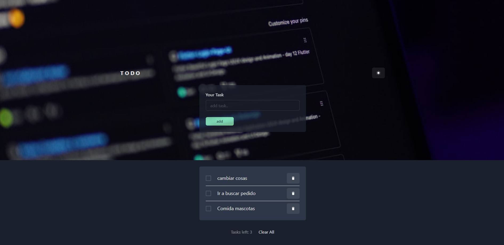

  

<h3 align="center">#sm</h3>
  
 To-do List App
         
        <a href="https://github.com/sanmoyano/to-do-list-.git"><strong>Docuementacion »</strong></a>
         
         
        <a href="https://to-do-list-eight-eta.vercel.app/">Ver Web »</a>
    

## Sobre el proyecto

El proyecto se trata del desarrollo de una aplicación web que permitirá a los usuarios crear una lista de tareas, agregar mas tareas y eliminarlas.

### Realizado en:

- [React Js](https://reactjs.org/)
- [Vite Js](https://vite.netlify.com/) Frontend Tooling
- La aplicacion web se encuentra deployada en [Vercel](https://vercel.com/).

### Librerias externas

<!-- - **react-router-dom** - para manejar las rutas de la aplicación web y el navegador. [Documentación](https://reacttraining.com/react-router/web/guides/quick-start) -->

- **chakra-ui** - para el desarrollo UI de la aplicación web. [Documentación](https://chakra-ui.com/docs/getting-started)

## Contacto
 [![LinkedIn][linkedin-shield]][linkedin-url]
 [![GitHub][github-shield]][github-url]
 [![Email][email-shield]][email-url]

 [linkedin-shield]: https://img.shields.io/badge/LinkedIn-linkedin-url?style=for-the-badge&label=LinkedIn&logo=linkedin&logoColor=white
[linkedin-url]: https://www.linkedin.com/in/santiago-moyano
[github-shield]: https://img.shields.io/badge/GitHub-github-url?style=for-the-badge&label=GitHub&logo=github&logoColor=white
[github-url]:https://github.com/sanmoyano
[email-shield]: https://img.shields.io/badge/Email-email-url?style=for-the-badge&label=Email&logo=email&logoColor=white
[email-url]: mailto:smoyano.di@gmail.com